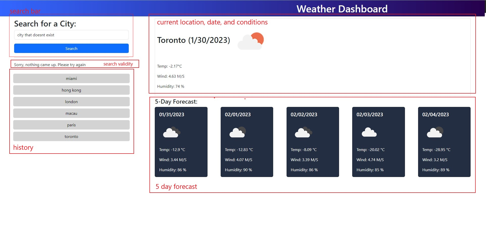

# Weather Dashboard

## Description
This app is a weather dashboard that helps travelers plan their trip accordingly. When users search a location, the location name, date and weather conditions appear to the right of the search bar.
The current weather conditions and status are shown in the top section while the 5 day forecast for that location are shown below.

## Deployed application

https://jjocelynn.github.io/weather-dashboard/

## Usage

Users simply need to enter a location and press the "search" button. If the thrid party API recognizes that location, the weather conditions will be displayed on the right and the location will be saved in the search history.
If the API does not recognize the location, users will be prompted to try again and nothing will be saved. 
When users re-load the page, the history will remain but the weather conditions will be blank until the user chooses another location.

## License

Please refer to the License in the repo.
